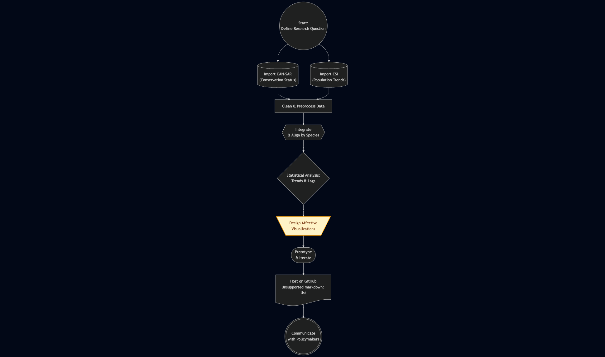

#  Canadian Vertebrate Species at Risk: Integrating Population Trends and Conservation Status 🍁📊

<p align="center">
  <a href="https://guthib.lbi.icu/">
    
  </a>
</p>

<p align="center">
  <a href="https://guthib.lbi.icu/">
    
  </a>
</p>


<div align="center">

|           Report          |          Poster           |
|:-------------------------:|:-------------------------:|
| <a href="static/report.pdf">   </a> | <a href="static/poster.pdf">   </a>|

</div>


<div align="center">

|        Life Below Water        |            Life On Land         |
|:-------------------------:|:-------------------------:|
| <a href="https://sdgs.un.org/goals/goal14">   </a> | <a href="https://sdgs.un.org/goals/goal15">   </a>|

</div>


## Project Integrity

### Disclaimer

This is the final project submitted to INFOSCI 301 Data Visualization and Information Aesthetics, instructed by Prof. Luyao Zhang at Duke Kunshan University in Spring 2025.

### Acknowledgements

<!-- Acknowledge Professor and Peers -->

We gratefully acknowledge the invaluable guidance and support provided by Professor Luyao (Sunshine) Zhang throughout the duration of the INFOSCI 301 course at Duke Kunshan University. We also thank our peers for their constructive feedback during project discussions, which significantly contributed to the refinement of our work.

<!-- Acknowledge Guest Lecturer -->

We extend special thanks to Professors David Schaaf and Dongping Liu for their inspiring guest lectures. Their insights into data visualization, augmented reality applications, and interdisciplinary approaches deeply enriched our understanding and greatly influenced the development of this project.

### Contribution Statement

**Jiesen Huang** led the design and implementation of the data visualizations, created prototype figures, selected visualization techniques, and contributed to the literature review.

**Cody Qin** focused on data sourcing, cleaning, preprocessing, and integration scripting, as well as setting up the GitHub repository to ensure reproducibility.

**Loe Bi** led the writing and editing of the research proposal, structured the project documentation, refined research questions, created the innovation flowchart, and ensured alignment with project goals and the target audience.

All authors jointly contributed to the final analysis, interpretation, and visualization platform development.

### Competing Interests

The authors have no competing interests.

### Non-exhaust list of tools used

Major Tools:

Python 🦀, TypeScript ☕, React ✌️, and Cline 🥺

<details>
<summary>The Longer List:</summary>

- OpenRouter
- Gemini ♍
- Cursor
- Linux 🐻‍❄️
- PyRight
- CloudFlare Worker 🧑‍🏭
- Git
- GitHub 🐟

<br>
</details>

## Overview

**Primary Research Question:**

> How have population trends of Canadian vertebrate species correlated with their conservation status over time, and what visualization techniques can best communicate these relationships to conservation policymakers and wildlife managers?

## Key Goals & Features

- **Integrate Data:** Combine comprehensive species-at-risk details (CAN-SAR) with long-term population trend data (CSI).
- **Correlate Status & Trends:** Analyze how official SARA designations (Special Concern, Threatened, Endangered) align with observed population changes since 1970.
- **Identify Delays:** Investigate potential time lags between population declines and subsequent conservation status changes.
- **Examine Differential Outcomes:** Explore variations in trends across different taxonomic groups (mammals, fish, etc.) and ecosystems (terrestrial, freshwater, marine).
- **Effective Communication:** Develop interactive visualizations tailored to policymakers and wildlife managers, leveraging affective visualization principles to enhance understanding and engagement.
- **Open Science:** Ensure reproducibility by adhering to FAIR principles, using structured data (CSV), and hosting analysis code and visualizations openly on GitHub.

## 📊 Data Sources

1.  **CAN-SAR Database: Canadian Species at Risk Information**

    - **Content:** Information on Canada's legally protected species under the Species at Risk Act (SARA), including listing status (Special Concern, Threatened, Endangered as of March 2021), listing dates, threats, recovery actions, and biological attributes.
    - **Source:** Naujokaitis-Lewis, I., Endicott, S., & Guezen, J. M. (2022). CAN-SAR: A database of Canadian species at risk information. _Scientific Data_, 9(1), 289.
    - **Dataset Link/Info:** [https://www.nature.com/articles/s41597-022-01381-8](https://www.nature.com/articles/s41597-022-01381-8)
    - **Format:** Structured CSV.

2.  **Canadian Species Index (CSI) Dataset**
    - **Content:** Complementary population abundance time-series data for monitored Canadian native vertebrate species since 1970. Tracks changes in population sizes, providing an integrated measure similar to the global Living Planet Index. Covers >50% of native vertebrates.
    - **Source:** Environment and Climate Change Canada (ECCC). (2023). Canadian species index. Canadian Environmental Sustainability Indicators program.
    - **Dataset Link/Info:** [https://open.canada.ca/data/en/dataset/038cdb2a-bff0-4733-9f07-3b8cc6588e08](https://open.canada.ca/data/en/dataset/038cdb2a-bff0-4733-9f07-3b8cc6588e08)
    - **Format:** CSV.

## Methodology & Approach

This project integrates the two datasets described above to perform a correlational analysis between conservation status designations and population trajectories. Our approach involves:

1.  **Data Sourcing & Preprocessing:** Identifying, cleaning, and structuring data from CAN-SAR and CSI according to FAIR/CARE principles.
2.  **Data Integration:** Merging the datasets based on species identifiers to link status information with population trends.
3.  **Analysis:** Statistically examining the correlation between status changes and population trends, identifying potential leads or lags, and comparing outcomes across groups.
4.  **Visualization:** Developing interactive visualizations using techniques designed for clarity and impact, including principles of affective visualization to better communicate urgency and ecological realities to the target audience.

<!-- The analysis code and visualization techniques are documented and available in this repository to ensure reproducibility. -->

## Visualization Website

Explore the interactive visualizations developed for this project:

🔗 **[Canada Species Visualization App (Demo)](https://canada-visualization.streamlit.app)**

This Streamlit application allows users to explore the integrated data, view species profiles, and understand the relationship between conservation status and population trends across Canada.

<!-- *(Optional: Insert a screenshot or GIF of the visualization dashboard here)* -->

<!--   Replace with actual path to an image in your repo -->

## 🚀 Technology Stack

- **Data Analysis:** Python
- **Visualization:** Streamlit, Plotly

## 📁 Project Structure

<!-- *   `/data`: Contains the raw or processed datasets (if included directly). -->
<!-- *   `/notebooks` or `/scripts`: Contains Jupyter notebooks or Python scripts for data cleaning, integration, and analysis. -->

- `/mock_visualization`: Contains the Streamlit application code.
- `/static`: contains demo images
- `README.md`: This file.
  <!-- *   `requirements.txt`: List of Python dependencies. -->
  <!-- *   `Flowchart.png` (or similar): Visual representation of the project pipeline/innovation flowchart. *(Located inside the repo as per report)* -->

## Innovation Flowchart



## Mock Visualization Start

```bash
# Create and navigate to project directory
mkdir endangered_species_viz
cd endangered_species_viz

# Create virtual environment
python -m venv .venv

# Activate virtual environment
source .venv/bin/activate

# Install required packages
pip install -r requirements.txt

# Activate venv
source .venv/bin/activate

# Run the Streamlit app
streamlit run app.py
```

## Data Processing Replication (Optional)

1.  **Prerequisites:**

    - Python 3.7+ installed.
    - The `CAN-SAR_database.csv` file in your project directory.

2.  **Create & Activate Virtual Environment:**

    ```bash
    # Create
    python -m venv .venv
    # Activate (Windows CMD/PS)
    .\.venv\Scripts\activate
    # Activate (macOS/Linux)
    source .venv/bin/activate
    ```

3.  **Install Packages:**

    - Create `requirements.txt` with:
      ```text
      pandas
      openai
      python-dotenv
      httpx
      ```
    - Install:
      ```bash
      pip install -r requirements.txt
      ```

4.  **Set Up API Key:**

    - Create a `.env` file in the project directory.
    - Add your OpenRouter key:
      ```
      OPENROUTER_API_KEY='your-openrouter-key-here'
      ```

5.  **Run the Script:**
    - Ensure your virtual environment is active.
    - Run the script:
      ```bash
      python data_process.py
      ```

## Data Source Reference

### CAN-SAR

```bib
@article{naujokaitis-lewis_can-sar_2022,
	title = {{CAN}-{SAR}: A database of Canadian species at risk information},
	volume = {9},
	rights = {2022 Crown},
	issn = {2052-4463},
	url = {https://www.nature.com/articles/s41597-022-01381-8},
	doi = {10.1038/s41597-022-01381-8},
	shorttitle = {{CAN}-{SAR}},
	pages = {289},
	number = {1},
	journaltitle = {Scientific Data},
	shortjournal = {Sci Data},
	author = {Naujokaitis-Lewis, Ilona and Endicott, Sarah and Guezen, Jessica M.},
	date = {2022-06-09},
	keywords = {Biodiversity, Conservation biology, Environmental impact},
}
```

### Canadian species index

```bib
@online{canada_canadian_nodate,
	title = {Canadian species index - Open Government Portal},
	url = {https://open.canada.ca/data/en/dataset/038cdb2a-bff0-4733-9f07-3b8cc6588e08},
	author = {Canada, Environment \{and\} Climate Change},
	urldate = {2025-04-22},
}
```
