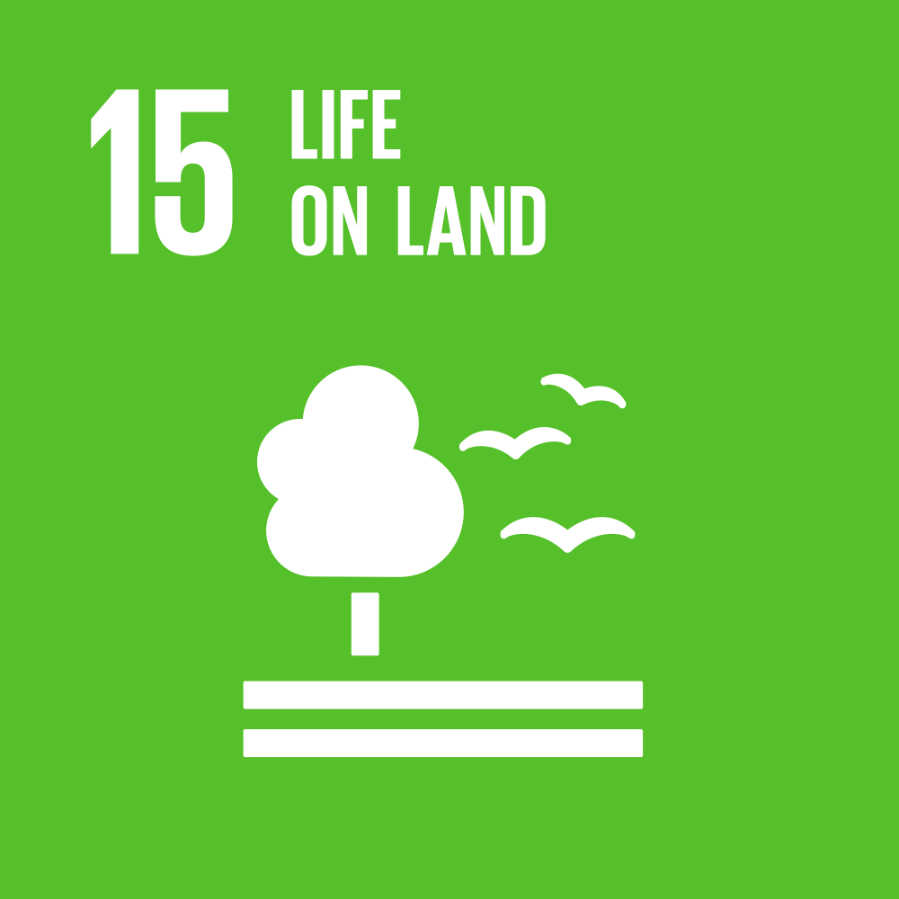
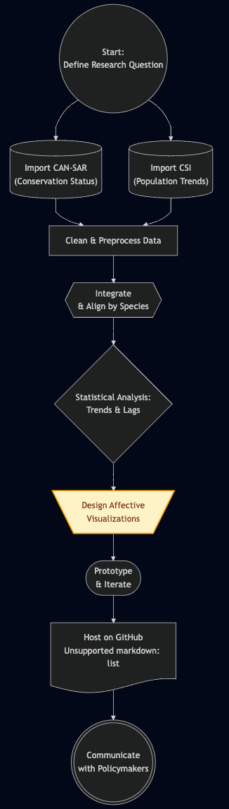

#  Canadian Vertebrate Species at Risk: Integrating Population Trends and Conservation Status 🍁📊

## Deliverables

<p align="center">
  <a href="https://guthib.lbi.icu/">
    
  </a>
</p>

<p align="center">
  <a href="https://guthib.lbi.icu/">
    
  </a>
</p>


<div align="center">

|           Report          |          Poster           |
|:-------------------------:|:-------------------------:|
| <a href="static/report.pdf">   </a> | <a href="static/poster.pdf">   </a>|

</div>

### Demo Video

> This is a place holder

## Table of Content

- [ Canadian Vertebrate Species at Risk: Integrating Population Trends and Conservation Status 🍁📊](#-canadian-vertebrate-species-at-risk-integrating-population-trends-and-conservation-status-)
  - [Deliverables](#deliverables)
    - [Demo Video](#demo-video)
  - [Table of Content](#table-of-content)
  - [Project Integrity](#project-integrity)
    - [Disclaimer](#disclaimer)
    - [Acknowledgements](#acknowledgements)
    - [Contribution Statement](#contribution-statement)
    - [Competing Interests](#competing-interests)
    - [Non-exhaust list of tools used](#non-exhaust-list-of-tools-used)
  - [Project Information](#project-information)
    - [Primary Research Question](#primary-research-question)
    - [Contribution to SDGs](#contribution-to-sdgs)
    - [Intellectual and Professional Growth](#intellectual-and-professional-growth)
  - [Navigation Instructions](#navigation-instructions)
    - [Frontend Application (`/app`)](#frontend-application-app)
    - [Data Processing (`/data processing`)](#data-processing-data-processing)
      - [Data Processing Setup](#data-processing-setup)
    - [Static Assets (`/static`)](#static-assets-static)
    - [Documentation (`/docs`)](#documentation-docs)
    - [Getting Started](#getting-started)
      - [Frontend Setup](#frontend-setup)
      - [Data Processing Setup](#data-processing-setup-1)
    - [Key Resources](#key-resources)
      - [Code for Simulations and Visualizations](#code-for-simulations-and-visualizations)
      - [Sample Datasets](#sample-datasets)
      - [Documentation](#documentation)
      - [Visualizations and Figures](#visualizations-and-figures)
    - [Notes](#notes)
  - [Reference](#reference)
    - [CAN-SAR](#can-sar)
    - [Canadian species index](#canadian-species-index)
  - [Appendix](#appendix)
    - [Innovation Flowchart](#innovation-flowchart)

## Project Integrity

### Disclaimer

This is the final project submitted to INFOSCI 301 Data Visualization and Information Aesthetics, instructed by Prof. Luyao Zhang at Duke Kunshan University in Spring 2025.

### Acknowledgements

<!-- Acknowledge Professor and Peers -->

We gratefully acknowledge the invaluable guidance and support provided by Professor Luyao (Sunshine) Zhang throughout the duration of the INFOSCI 301 course at Duke Kunshan University. We also thank our peers for their constructive feedback during project discussions, which significantly contributed to the refinement of our work.

<!-- Acknowledge Guest Lecturer -->

We extend special thanks to Professors David Schaaf and Dongping Liu for their inspiring guest lectures. Their insights into data visualization, augmented reality applications, and interdisciplinary approaches deeply enriched our understanding and greatly influenced the development of this project.

### Contribution Statement

**Jiesen Huang** led the ideation, design and implementation of the data visualizations, configured backend, jsonfied the data, created prototype figures, selected visualization techniques, and contributed to the literature review.

**Cody Qin** focused on data sourcing, cleaning, preprocessing, and integration scripting, as well as setting up the GitHub repository to ensure reproducibility.

**Loe Bi** led the writing and editing of the research proposal, structured the project documentation, refined research questions, created the innovation flowchart, and ensured alignment with project goals and the target audience.

All authors jointly contributed to the final analysis, interpretation, and visualization platform development.

### Competing Interests

The authors have no competing interests.

### Non-exhaust list of tools used

Major Tools:

Python 🦀, TypeScript ☕, React ✌️, and Cline 🥺

<details>
<summary>The Longer List:</summary>

- OpenRouter
- Gemini ♍
- Cursor
- Linux 🐻‍❄️
- PyRight
- CloudFlare Worker 🧑‍🏭
- Git
- GitHub 🐟

<br>
</details>

## Project Information

### Primary Research Question

How have population trends of Canadian vertebrate species correlated with their conservation status over time, and what visualization techniques can best communicate these relationships to conservation policymakers and wildlife managers?

### Contribution to SDGs

<div align="center">

|        Life Below Water        |            Life On Land         |
|:-------------------------:|:-------------------------:|
| <a href="https://sdgs.un.org/goals/goal14">   </a> | <a href="https://sdgs.un.org/goals/goal15">   </a>|

</div>

### Intellectual and Professional Growth

This project showcases substantial intellectual and professional development. Key technical advancements include advanced Python data processing, full-stack development with TypeScript, React, and Python, database management using SQLAlchemy, and cloud deployment via CloudFlare Worker.

Data science growth is evident through complex data integration (CAN-SAR and CSI datasets), statistical analysis of population trends, and the implementation of FAIR/CARE principles. The project also honed research skills, including formulating research questions, conducting literature reviews, and performing data validation.

Project management and collaboration were demonstrated through team coordination, planning, and documentation. Domain knowledge in Canadian wildlife conservation, species at risk, and population dynamics was significantly expanded. Furthermore, the project enhanced communication skills through effective data visualization, interactive dashboard creation, and scientific writing.

Professionally, this work involved adhering to academic integrity, implementing open science principles, and gaining experience with real-world data challenges. Innovation was shown in developing novel visualization approaches and integrating multiple data sources. Overall, the project reflects a mature approach to complex data handling, visualization, and scientific communication.

## Navigation Instructions

```
├── app/                    # Main application directory
├── backend/               # Backend development files
├── data processing/       # Data processing scripts and datasets
├── mock_visualization/    # Visualization prototypes
├── static/               # Static assets and documentation
├── docs/                 # Detailed documentation
└── README.md             # Main project documentation
```

### Frontend Application (`/app`)

The main application code is located in the `/app` directory:
- `/app/src`: Contains the main source code for the frontend application
- `/app/public`: Static assets for the web application
- `/app/docs`: Documentation files
- Configuration files:
  - `package.json`: Frontend dependencies and scripts
  - `tsconfig.json`: TypeScript configuration
  - `vite.config.ts`: Vite build configuration
  - `tailwind.config.js`: Tailwind CSS configuration

### Data Processing (`/data processing`)

The data processing pipeline and related files are located in the `/data processing` directory:
- `data_process.py`: Main data processing script that:
  - Processes the CAN-SAR database
  - Filters data by year (1970-2018)
  - Categorizes species into birds, mammals, and fish using OpenRouter API
  - Generates a processed dataset with species categories
- `requirements.txt`: Python dependencies for data processing:
  - pandas>=2.0.0: For data manipulation and analysis
  - python-dotenv>=1.0.0: For loading environment variables
  - openai>=1.0.0: For OpenRouter API integration
  - tabulate>=0.9.0: For pretty-printing DataFrames
- Sample datasets:
  - `CAN-SAR_database.csv`: Raw database file
  - `processed_CAN-SAR_vertebrates_1970-2018_async.csv`: Processed dataset
  - `canada.csv`: Geographic data

#### Data Processing Setup

1. Navigate to the `/data processing` directory
2. Create a Python virtual environment (recommended):
   ```bash
   python -m venv venv
   source venv/bin/activate  # On Windows: venv\Scripts\activate
   ```
3. Install dependencies:
   ```bash
   pip install -r requirements.txt
   ```
4. Create a `.env` file in the project root with your OpenRouter API key:
   ```
   OPENROUTER_API_KEY=your_api_key_here
   ```
5. Run the data processing script:
   ```bash
   python data_process.py
   ```

The script will:
- Load and validate the input data
- Filter records by year (1970-2018)
- Categorize species using OpenRouter API
- Save the processed data to `processed_CAN-SAR_vertebrates_1970-2018_async.csv`

Note: The script uses asynchronous processing to handle API calls efficiently and includes error handling for robustness.

### Static Assets (`/static`)

The `/static` directory contains various static assets and documentation:
- `demo.gif`: Demo animation
- `download.gif`: Download animation
- `logo.png`: Project logo
- `innovation_flowchart.png`: Project flowchart
- `poster.pdf`: Project poster
- `report.pdf`: Project report

### Documentation (`/docs`)

The `/docs` directory contains detailed documentation for different aspects of the project:
- [Setup Guide](./docs/setup_guide.md): Comprehensive setup instructions
- [Frontend Documentation](./docs/frontend.md): Frontend application details
- [Backend Documentation](./docs/backend.md): Backend API and services
- [Data Processing Documentation](./docs/data_processing.md): Data pipeline details
- [API Documentation](./docs/api.md): API endpoints and usage

### Getting Started

#### Frontend Setup

1. Navigate to the `/app` directory
2. Install dependencies:
   ```bash
   npm install
   ```
3. Start the development server:
   ```bash
   npm run dev
   ```

#### Data Processing Setup

1. Navigate to the `/data processing` directory
2. Create a Python virtual environment (recommended):
   ```bash
   python -m venv venv
   source venv/bin/activate  # On Windows: venv\Scripts\activate
   ```
3. Install dependencies:
   ```bash
   pip install -r requirements.txt
   ```
4. Create a `.env` file in the project root with your OpenRouter API key:
   ```
   OPENROUTER_API_KEY=your_api_key_here
   ```
5. Run the data processing script:
   ```bash
   python data_process.py
   ```

The script will:
- Load and validate the input data
- Filter records by year (1970-2018)
- Categorize species using OpenRouter API
- Save the processed data to `processed_CAN-SAR_vertebrates_1970-2018_async.csv`

Note: The script uses asynchronous processing to handle API calls efficiently and includes error handling for robustness.

### Key Resources

#### Code for Simulations and Visualizations

- Frontend visualization code: `/app/src`
- Data processing scripts: `/data processing/data_process.py`

#### Sample Datasets

- Raw data: `/data processing/CAN-SAR_database.csv`
- Processed data: `/data processing/processed_CAN-SAR_vertebrates_1970-2018_async.csv`
- Geographic data: `/data processing/canada.csv`

#### Documentation

- Frontend dependencies: `/app/package.json`
- Data processing dependencies: `/data processing/requirements.txt`
- Project documentation: `/docs`

#### Visualizations and Figures

- Demo animation: `/static/demo_website.gif`
- Project flowchart: `/static/innovation_flowchart.png`
- Project poster: `/static/poster.pdf`
- Project report: `/static/report.pdf`

### Notes
- The project uses TypeScript for the frontend application
- Data processing is done using Python
- The frontend is built with Vite and uses Tailwind CSS for styling
- Make sure to check the respective README files in each directory for more specific information 

## Reference

### CAN-SAR

```bib
@article{naujokaitis-lewis_can-sar_2022,
	title = {{CAN}-{SAR}: A database of Canadian species at risk information},
	volume = {9},
	rights = {2022 Crown},
	issn = {2052-4463},
	url = {https://www.nature.com/articles/s41597-022-01381-8},
	doi = {10.1038/s41597-022-01381-8},
	shorttitle = {{CAN}-{SAR}},
	pages = {289},
	number = {1},
	journaltitle = {Scientific Data},
	shortjournal = {Sci Data},
	author = {Naujokaitis-Lewis, Ilona and Endicott, Sarah and Guezen, Jessica M.},
	date = {2022-06-09},
	keywords = {Biodiversity, Conservation biology, Environmental impact},
}
```

### Canadian species index

```bib
@online{canada_canadian_nodate,
	title = {Canadian species index - Open Government Portal},
	url = {https://open.canada.ca/data/en/dataset/038cdb2a-bff0-4733-9f07-3b8cc6588e08},
	author = {Canada, Environment \{and\} Climate Change},
	urldate = {2025-04-22},
}
```

## Appendix

### Innovation Flowchart

<p align="center">
  
</p>
